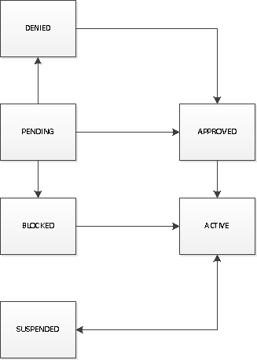

Command line User and Project Management
========================================

This module deals with management of users and projects using CMD3.

The code is located at:

* https://github.com/cloudmesh/management.git

**Assumptions:**

* Python 2.7.9 is installed
* virtual environment is installed and setup (for example, virtualenv ~/ENV -p <path to python version 2.7.9>)
* Cloudmesh is installed
* mongo server is running (fab server.start)

Clone the module for bson and build it::

    git clone https://github.com/martinkou/bson.git
    python setup.py install

Clone the project with::

    git clone https://github.com/cloudmesh/management.git

Change to the cloned directory::

    cd management

Setup the requirements with::

    python setup.py requirements

Install the module::

    python setup.py install

Install the YAML files::

    python setup.py yaml

If you are starting from scratch, the commands that needs to be run are listed below::

    git clone https://github.com/martinkou/bson.git
    python setup.py install
    pip install cloudmesh_base
    pip install cmd3
    pip install cloudmesh_database
    python setup.py requirements
    python setup.py install
    python setup.py yaml

.. note::

    The fields of the User and Project objects can be generated dynamically from the YAML file in the directory
    "etc/accounts". A default file for **user** is available under etc/accounts/cloudmesh_user.yaml and a default file for
    **project** is available under etc/accounts/cloudmesh_project.yaml. To add/remove fields, amend the YAML file as required. When
    you do "python setup.py yaml", the files are moved to "~/.cloudmesh/accounts" directory.

How to add/amend fields to the YAML file::

    * Amend the file(s) under etc/accounts/
    * The fields are listed under::
        cloudmesh:
            user:
                fields:
    * Each field is described as shown below::
        - <Field Name>:
            label: <Label for field>
            type: <Field type>
            required: <True/False>
            reference: <Reference field>[OPTIONAL]
            options:
                - option 1
                - option 2
                - option n

    * The field type can be: text, textarea, dropdown, password, list, checkbox, email
    * If any of the field, references to an existing field, "reference: " needs to be set to the existing field
    * If a field has options, "options: ", needs to be set as shown above
    * If the field is in [text, textarea, dropdown, password] and has a reference field, the field is mapped as a ListField[ReferenceField]
    * If the field is in [text, textarea, dropdown, password] and has options, the field is mapped as a ListField[StringField]
    * If the field is just in [text, textarea, dropdown, password], the field is mapped as a StringField
    * If the field is a checkbox, the field is mapped to a BooleanField
    * If the field is a email, the field is mapped to a EmailField
    * UUIDField() is being used to generate a Project ID and User ID

If you make any amendments to the file under "etc/accounts", follow the steps below::

    * python setup.py resetyaml
    * python setup.py regenfile (This regenerates the files base_user.py and base_project.py under cloudmesh_management)
    * python setup.py install

If everything is setup correctly, run the following command::

    cm management help

You should see the screen below::

    management: Command line for Administrators to manage users and projects

            Usage:
                management version
                management admin user generate [--count=N]
                management admin user list [USERNAME] [--format=FORMAT]
                management admin user add [YAMLFILE]
                management admin user delete [USERNAME]
                management admin user clear
                management admin user status USERNAME
                management admin user approve [USERNAME]
                management admin user activate [USERNAME]
                management admin user suspend [USERNAME]
                management admin user block [USERNAME]
                management admin user deny [USERNAME]
                management admin user assign [USERNAME] [ROLE]
                management admin user password USERNAME PASSWORD
                management admin user projects USERNAME
                management admin project generate [--count=N]
                management admin project list [PROJECTID] [--format=FORMAT]
                management admin project add [YAMLFILE]
                management admin project delete [PROJECTID]
                management admin project clear
                management admin project status [PROJECTID]
                management admin project activate [PROJECTID]
                management admin project deactivate [PROJECTID]
                management admin project close [PROJECTID]
                management admin project add [USERNAME] [PROJECTID] [ROLE]
                management admin project remove [USERNAME] [PROJECTID] [ROLE]
                management admin export [DATABASE] [COLLECTION] [--user=USERNAME] [--password=PASSWORD]
                management admin import [--file=FILENAME] [--dir=DIRNAME] [--db=DBNAME] [--collection=NAME]  [--user=USERNAME] [--password=PASSWORD]
                management committee setup
                management committee reviewer add [PROJECTID] [USERNAME]
                management committee reviewer remove [PROJECTID] [USERNAME]
                management committee list
                management committee project list [PROJECTID] [--format=FORMAT]
                management committee project status
                management committee project approve [PROJECTID]
                management committee project deny [PROJECTID]
                management committee project block [PROJECTID]
                management committee project activate [PROJECTID]
                management committee project close [PROJECTID]
                management committee project open [PROJECTID]
                management user apply [--user=USERFILE|--project=PROJECTFILE]
                management user configure [USERNAME]
                management user password
                management user status
                management user add-sshkey [FILENAME]

            Options:
                --format=json   Show the user details in json format

Workflow
========

User
    - User applies for an account using "cm management user apply --user=USERFILE
    - Configure user using "cm management user configure [USERNAME]

Admin
    - On getting notified (Notification is yet to be implemented), Check user status using "cm management admin user status"
    - Approve and activate the user using "cm management admin user approve USERNAME" and "cm management admin user activate USERNAME"
    - Assign a role if the user is other than a non-normal user using "cm management admin user assign [USERNAME] [ROLE]"

Committee
    - While setting up the system, set up a committee using the command "cm management committee setup"
    - On getting notified (Notification is yet to be implemented) about project approval request:
        - Approve a project using the command "cm management committee project approve [PROJECTID]"
        - Deny a project using the command "cm management committee project deny [PROJECTID]

Initialize the system
======================

Steps to initialize the system::

    cm management user configure [USERNAME]
        - This step puts an entry into the local hidden file under "**~/.cloudmesh/accounts/.config**"

Roles
=====

There are three roles at the moment in the system.

    User (user)
        General user
    Admin (admin)
        Role used to manage users like add/delete users, change user status, assign user role and assign password
    Reviewer (reviewer)
        Role used to add/remove reviewers, approve projects

Note::

    - When the system is installed, a super user named "super" is created with all the 3 roles assigned to it.
    - The Authorization is being imposed by a decorator function, which checks the roles assigned to the current user.
    - If the user has the required roles, the information is displayed else an error message is thrown.
    - The name of the current user is stored in a hidden configuration file under "**~/.cloudmesh/accounts/.config**"
    - This file can be used to store secret keys for the user later when authentication mechanism is being built.

Manage Users
============

To generate a list of users run::

    cm management user generate

To generate "n" number of users run::

    cm management user generate --count=n

To clear all the users within the database::

    cm management user clear

To set a password for a user::

    cm management user password <USERNAME> <PASSWORD>

.. note::

    The password is encrypted using sha256 encryption algorithm and the hash value is stored in Mongo.

To get a list of users run::

    cm management user list

To get detail about a particular user::

    cm management user list USERNAME

To add a user using a YAML file::

    cm management user add <PATH TO YAML FILE>

.. note::

    A sample YAML file is available in etc directory within managament

To amend a status of the user::

    * User will be in pending state by default
    * The commands to change the user status are cls explanatory

.. note::

    The state changes for a user is listed in the figure below:

Manage Projects
===============

To generate a list of projects run::

    cm management project generate

To generate "n" number of dummy projects::

    cm management project generate --count=n

To clear the projects within the database::

    cm management project clear

To add a member to a project::

    cm management project add member <USERID> <PROJECTID> <ROLE>

.. note::

    The user roles are member, lead, alumni. When adding a user as a member or lead, the USERID should be available
    within the database. If not an error message would be displayed. An alumni need not be a valid user within the
    system. No check will be done against the alumni role. When you add a user as a lead or a member, user will be
    appended to the existing list accordingly.

To remove a member from a project::

    cm management project remove member <USERID> <PROJECTID>

To activate a project::

    cm management project activate <PROJECT ID>

To deactivate a project::

    cm management project deactivate <PROJECT ID>

To close a project::

    cm management project close <PROJECT ID>

Export/Import Collections
=========================

To export collection(s) from a database::

    cm management export <DATABASENAME> <COLLECTION NAME>

.. note::

    - To pass the username and password to access the database as parameters use --user=<USERNAME> and --password=<PASSWORD>. If the username and password is not passed, the system tried to get the details from the file, cloudmesh_server.yaml. If the details are not available in the yaml file, it tries to connect without them.

    - If <COLLECTION NAME> is not specified, the system tries to export all the non system collections to a json file and the file name would be the name of the collection.

To import data from json file into a database::

    cm management import --file=<FILE NAME> --db=<DATABASE NAME>

                        or

    cm management import --dir=<DIR NAME> --db=<DATABASE NAME>

.. note::

    - To pass the username and password to access the database as parameters use --user=<USERNAME> and --password=<PASSWORD>. If the username and password is not passed, the system tried to get the details from the file, cloudmesh_server.yaml. If the details are not available in the yaml file, it tries to connect without them.

    - A file name or a directory name needs to be passed as source of the data.

Yet to be done
==============

**Notification Mechanisms**
    When the user applies for an account/project, notification needs to be put in place to let the admin/reviewer know about the pending account/project request.

**Authentication and Security**
    Authentication and Security is yet to be done

**Add users in Bulk**
    At the moment, there is only an option to add single user from the yaml file. This needs to be extended to cover multiple users.

**Start mongo if mongo is not running while using the "cm management" commands**
    The file mongo.py has the code that is taken from mongo.py under **fabfile** directory in cloudmesh. This has three
    methods: "get_status", "start" and "stop". Need to understand the way cm works and where to hook these methods.